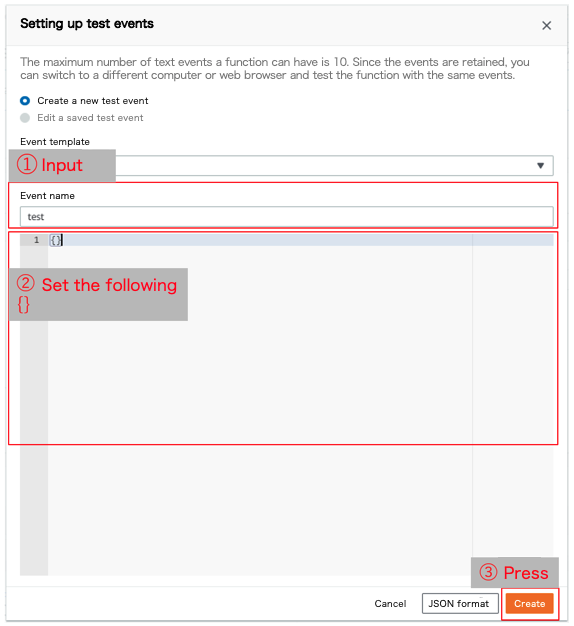

# Steps to build the backend
## Deploy peripheral resources

The following peripheral resources must be deployed in the hair salon app:

1. Common processing layer (Layer)
1. Periodic execution batch (batch)

### 1. Common processing layer (Layer)

In AWS Lambda, you can describe the process you want to use in common with multiple Lambda functions as a layer.
Since this app uses layers, first deploy the layers by following these steps:

- Change template.yaml
  Open template.yaml in the backend > Layer folder and change this parameter item in the EnvironmentMap dev:

  - `LayerName` any layer name
  - `MessageTableName` Any table name (a table to manage reminder messages)

- Run this command:

```
cd [backend > Layer folder]
sam build --use-container
sam deploy --guided
*Must be specified when using profile information that's not the default (`sam deploy --guided --profile xxx`)
    Stack Name: any stack name
    AWS Region: ap-northeast-1
    Parameter Environment: dev
    #Shows you resources changes to be deployed and require a 'Y' to initiate deploy Confirm changes before deploy [Y/n]: Y
    #SAM needs permission to be able to create roles to connect to the resources in your template Allow SAM CLI IAM role creation[Y/n]: Y
    Save arguments to samconfig.toml [Y/n]: Y

    SAM configuration file [samconfig.toml]: Press Enter only
    SAM configuration environment [default]: Press Enter only

    Deploy this changeset? [y/N]: y
```

- Note the layer version
  After deployment, the layer ARN and layer version will be displayed in the Outputs section of the terminal, so note the layer version.
  The layer version is the number at the end.
  *The version is updated every time you deploy, so the correct version for your first deployment is version 1.
  

- [Confirmation] Open the Lambda console in the AWS Management Console, select "Layers" from the left tab, and confirm that the layer you deployed this time exists.

### 2. Periodic execution batch (batch)

Deploy the short-term channel access token update batch and reminder message management batch required by this app.
Since the short-term channel access tokens expire 30 days after they are obtained, we run a batch every day at regular intervals to reacquire the short-term channel access tokens and update the tables before they expire.
Reminder messages are managed in a DynamoDB table, and a batch is executed every day at a fixed time to refer to the values in the table and send reminder messages.
We use the Amazon Event Bridge [official documentation](https://docs.aws.amazon.com/eventbridge/latest/userguide/eb-what-is.html) to get the batch working on time.
Follow these steps to deploy the batch:

- Change template.yaml
  Open template.yaml in the backend > batch folder and change this parameter item in the EnvironmentMap dev:

  - `MessageTableName` The same table name as when deploying layers
  - `LINEChannelAccessTokenDBName` Any table name (the table that manages short-term channel access tokens)
  - `EventBridgeName` Any event bridge name
    Example: AccessTokenUpdateEvent
  - `LayerVersion` The version number of the layer deployed in the [1. Common processing layer] procedure
    Example: LayerVersion: 1
  - `LoggerLevel` INFO or Debug
    Example: INFO
  - `TTL` True or False (Whether to delete message information automatically or not)
  - `TTLDay` Any number (If TTL is True, specify how many days after registration the reservation information will be deleted; if TTL is False, enter 0)

- Run this command:

```
cd [folder where template.yaml is located in [backend > batch]]
sam build --use-container
sam deploy --guided
*Must be specified when using profile information that's not the default (`sam deploy --guided --profile xxx`)
    Stack Name: any stack name
    AWS Region: ap-northeast-1
    Parameter Environment: dev
    #Shows you resources changes to be deployed and require a 'Y' to initiate deploy Confirm changes before deploy [Y/n]: Y
    #SAM needs permission to be able to create roles to connect to the resources in your template Allow SAM CLI IAM role creation[Y/n]: Y
    Save arguments to samconfig.toml [Y/n]: Y

    SAM configuration file [samconfig.toml]: Press Enter only
    SAM configuration environment [default]: Press Enter only

    Deploy this changeset? [y/N]: y
```

- Register the channel ID and channel secret in the table
  - Log in to the AWS Management Console and open the DynamoDB console
  - Create an item in the "Table for managing short-term channel access tokens" created earlier, and register the channel ID and channel secret of the Messaging API channel created in [Creating a LINE channel] as follows
    The channel ID and channel secret can be found in the basic channel settings in the [LINE Developers Console](https://developers.line.biz/console/).
    - channelId: Channel ID (String)
    - channelSecret: Channel secret (String)
      
- Execute the Lambda function for updating the channel access token
  - Log in to the AWS Management Console and open the Lambda console
  - Open the Lambda function you just created (the function name is HairSalon-PutAccessToken-{value specified in Environment})
  - Select "Test Event Settings" from the test event selection drop-down menu in the top-right corner of the Lambda function console
  - When the following window opens, enter the event name, leave the event content empty, and click the Create button
    
  - Press the Test button in the top-right corner of the Lambda function console to run the test
- [Confirmation] In the DynamoDB console of the AWS management console, open the channel access token table and confirm that the channelAccessToken, limitDate, and updatedTime items are added to the LINE channel ID data used in this app

## Deploying a hair salon application (APP)

Follow the steps below to deploy the hair salon app.

- Change template.yaml
  Open template.yaml in the backend > APP folder, and modify these parameter items of dev in EnvironmentMap:
  *If you need the S3 access log, uncomment the part that says ACCESS LOG SETTING.

  - `LINEOAChannelId` The channel ID of the Messaging API channel created in [Creating a LINE channel]
  - `LIFFChannelId` The channel ID of the LIFF channel created in [Creating a LINE channel]
  - `HairSalonShopMasterDBName` Any table name (table to register hair salon store information)
  - `HairSalonReservationInfoDBName` Any table name (a table that manages reservation information for customers)
  - `HairSalonStaffReservationDBName` Any table name (a table that manages reservation information for each hair salon staff)
  - `LINEChannelAccessTokenDBName` Table name of the "table that manages the short-term channel access token" deployed in the [2. Periodic execution batch] procedure
  - `MessageTable` Table name of "Table to manage reminder messages" deployed in the [2. Periodic execution batch] procedure
  - `RemindDateDifference` How many days before the reservation date to send the reminder message by the app (set to -1 if it's 1 day before)
    Example: RemindDateDifference: -1 *If you don't need to change it, set it to -1
  - `FrontS3BucketName` Any bucket name *This will be the S3 bucket name for placing the front-side module of the hair salon app.
  - `LayerVersion` The version number of the layer deployed in the [1. Common processing layer] procedure
    Example: LayerVersion: 1
  - `LoggerLevel` INFO or Debug
  - `LambdaMemorySize` Lambda memory size
    Example) LambdaMemorySize: 128 *If you don't need to change it, specify the minimum size of 128
  - `TTL` True or False (whether to delete reservation information automatically)
  - `TTLDay` Any number (If TTL is True, specify how many days after registration the reservation information will be deleted; if TTL is False, enter 0)
  - `LogS3Bucket` Any bucket name (the name of the S3 where the access log is stored)
  *Cancel the comment and record it only if you need an access log. Also, if you've already built another Use Case app, specify its access log bucket name and alias.
  - `LogFilePrefix` Any name (log file prefix)
  *Cancel the comment and record it only if you need an access log.

- Run this command:

```
cd [backend > APP folder]
sam build --use-container
sam deploy --guided
*Must be specified when using profile information that's not the default (`sam deploy --guided --profile xxx`)
    Stack Name: any stack name
    AWS Region: ap-northeast-1
    Parameter Environment: dev
    Parameter ChannelType [LIFF]: LIFF
    #Shows you resources changes to be deployed and require a 'Y' to initiate deploy Confirm changes before deploy [Y/n]: Y
    #SAM needs permission to be able to create roles to connect to the resources in your template Allow SAM CLI IAM role creation[Y/n]: Y
    ××××× may not have authorization defined, Is this okay? [y/N]: y (Input "y" for all)
    Save arguments to samconfig.toml [Y/n]: Y

    SAM configuration file [samconfig.toml]: Press Enter only
    SAM configuration environment [default]: Press Enter only

    Deploy this changeset? [y/N]: y
```

- Notes on API Gateway URL and CloufFrontDomainName
Take note of the API Gateway endpoint URL and CloudFrontDomainName displayed in OutPut when the deployment is successful.


## Error handling

- If you encounter the following error when deploying, follow this procedure to resolve it.
  ```
  Export with name xxxxx is already exported by stack sam-app. Rollback requested by user.
  ```
  - Deploy after modifying backend > Layer > template.yaml with reference to the following:
    ```
    Outputs:
      UseCaseLayerName:
        Description: "UseCaseLayerDev Layer Name"
        Value: !FindInMap [EnvironmentMap, !Ref Environment, LayerName]
        Export:
          Name: HairSalonLayerDev > Modify this to any name you want
    ```
  - Modify backend > batch > template.yaml with reference to the following description. There are multiple files, so modify them all.
    ```
    !ImportValue HairSalonLayerDev > Modify HairSalonLayerDev to the name you just entered
    ```
  - Modify backend > APP > template.yaml with reference to the following description. There are multiple files, so modify them all.
    ```
    !ImportValue HairSalonLayerDev > Modify HairSalonLayerDev to the name you just entered
    ```


*If you're building a production environment, use this link to move to the next page.  
[Next page (Production environment)](front-end-construction.md)  

*If you're building a local environment, use this link to move to the next page.  
[Next page (Local environment)](front-end-development-environment.md)  

[Back to Table of Contents](README_en.md)
