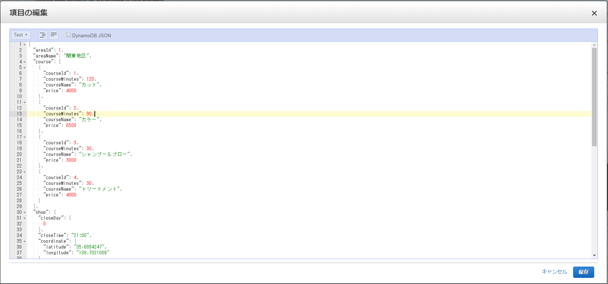

# テストデータの投入
- DynamoDB へテストデータの投入  
  本アプリの動作には店舗情報のデータを投入する必要があります。
  ヘアサロンアプリデプロイ時に template.yaml の HairSalonShopMasterDBName に設定したテーブル名のテーブルに、テストデータを投入してください。
  テストデータはbackend -> APPフォルダ内、dynamodb_data/shop_master_id_1.json ~ shop_master_id_6.json の json 形式文字列です。
  AWSマネジメントコンソールの DynamoDB コンソールにて、ペーストして投入します。(※以下画像参照)  

  【テストデータの投入】
  

  また、json テキストの lineAccountUrl の＠以下の部分は、作成頂いた MessagingAPI チャネルのボットのベーシック ID に変更していただく必要があります。  

  【ボットのベーシック ID 確認】
  

[次の頁へ](validation.md)

[目次へ戻る](../../README.md)
